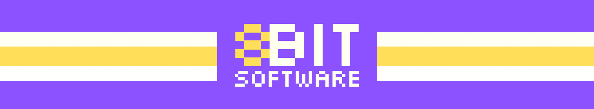

<!-- Get more cards from https://github.com/DenverCoder1/ -->
<!-- Get badges from https://shields.io/ | Start link with: https://img.shields.io/badge/ -->
<!-- Get logos from https://simpleicons.org/ -->
<!-- Get custom badges from https://custom-icon-badges.demolab.com/ | Start link with: https://custom-icon-badges.demolab.com/badge/ -->

## 😎 BroCodez-Courses
> 📎Follow [@BroCodez](https://www.youtube.com/@BroCodez) on YouTube for free and useful courses on basic programming languages.  
> [![my-website][0]](https://8bitsian.github.io/)
[![stack-overflow][1]](https://stackoverflow.com/users/32219858/8bitsian)
[![bluesky][2]](https://bsky.app/profile/8bitsoftware.bsky.social)
[![twitch][3]](https://www.twitch.tv/8bitsoftware)
[![youtube][4]](https://www.youtube.com/@8BitSoftware) 
![repo size][5]
![repo forks][6]
![repo stars][7]
![repo eyes][8] 
![total commit][9]
![last commit][10] 

## 🛠️ Tech & Tools
<!-- The World Wide Web Consortium (W3C) develops the HTML5 and CSS standards from https://www.w3.org/ -->
> 🐧 I am a Linux Mint user with experience in Windows 11 and 10 operating systems.  
> [![Linux Mint Badge][11]](https://www.linuxmint.com/)
![Windows 11 Badge][12]

> ⚙️ My workflow consists of developing with Geany and GitHub Desktop, and then documenting with Obsidian and GitHub.  
> [![Obsidian Badge][13]](https://obsidian.md/)
![GitHub Badge][14]
[![GitHub Desktop Badge][ghdesk]](https://github.com/apps/desktop)
[![Git Badge][15]](https://git-scm.com/)
[![Geany Badge][16]](https://www.geany.org/)
[![VSCodium Badge][17]](https://vscodium.com/) 

> 🗣️ I am following tutorials for Python, Java, C++, C# and C for full-stack development.  
> ![Total Languages Badge][18]
![Top Langauge Badge][19] 
> [![Python Badge][20]](https://www.python.org/)
[![Java Badge][21]](https://www.java.com/)
[![C++ Badge][22]](https://isocpp.org/)
[![C# Badge][23]](https://isocpp.org/)
[![C Badge][24]](https://isocpp.org/)

<!-- Links placed here for the file's readability -->
<!-- Social Media -->
[0]: https://img.shields.io/badge/My_Website-2026?logo=firefoxbrowser&logoColor=%23f6f4f0&labelColor=%238c52ff&color=%23ffde59
[1]: https://img.shields.io/badge/Stack_Overflow-2026?logo=stackoverflow&logoColor=%23f6f4f0&labelColor=%238c52ff&color=%23ffde59
[2]: https://img.shields.io/badge/BlueSky-2026?logo=bluesky&logoColor=%23f6f4f0&labelColor=%238c52ff&color=%23ffde59
[3]: https://img.shields.io/badge/Twitch-2026?logo=twitch&logoColor=%23f6f4f0&labelColor=%238c52ff&color=%23ffde59
[4]: https://img.shields.io/badge/YouTube-2026?logo=youtube&logoColor=%23f6f4f0&labelColor=%238c52ff&color=%23ffde59

<!-- Statistics -->
[5]: https://custom-icon-badges.demolab.com/github/repo-size/8Bitsian/BroCodez-Courses?style=flat&logo=repo&logoColor=FFFFF0&label=Repository%20Size&labelColor=8C52FF&color=FFDE59
[6]: https://custom-icon-badges.demolab.com/github/forks/8Bitsian/BroCodez-Courses?style=flat&logo=repo-forked&logoColor=FFFFF0&label=Forks&labelColor=8C52FF&color=FFDE59
[7]: https://custom-icon-badges.demolab.com/github/stars/8Bitsian/BroCodez-Courses?style=flat&logo=star&logoColor=FFFFF0&label=Stars&labelColor=8C52FF&color=FFDE59
[8]: https://custom-icon-badges.demolab.com/github/watchers/8Bitsian/BroCodez-Courses?style=flat&logo=eye&logoColor=FFFFF0&label=Watchers&labelColor=8C52FF&color=FFDE59
[9]: https://custom-icon-badges.demolab.com/github/commit-activity/t/8Bitsian/BroCodez-Courses?style=flat&logo=git-commit&logoColor=FFFFF0&label=Total%20Commits&labelColor=8C52FF&color=FFDE59
[10]: https://custom-icon-badges.demolab.com/github/last-commit/8Bitsian/BroCodez-Courses?display_timestamp=author&style=flat&logo=git-merge&logoColor=FFFFF0&label=Last%20Commit&labelColor=8C52FF&color=FFDE59

<!-- Operating Systems -->
[11]: https://img.shields.io/badge/Linux_Mint-2026?logo=linuxmint&logoColor=FFFFF0&labelColor=8C52FF&color=FFDE59
[12]: https://custom-icon-badges.demolab.com/badge/Windows-2026?style=flat&logo=windows11&logoColor=FFFFF0&labelColor=8C52FF&color=FFDE59

<!-- Software -->
[13]: https://img.shields.io/badge/Obsidian-2026?logo=obsidian&logoColor=FFFFF0&labelColor=8C52FF&color=FFDE59
[14]: https://img.shields.io/badge/GitHub-2026?logo=github&logoColor=FFFFF0&labelColor=8C52FF&color=FFDE59
[ghdesk]: https://img.shields.io/badge/GitHub_Desktop-2026?logo=github&logoColor=FFFFF0&labelColor=8C52FF&color=FFDE59
[15]: https://custom-icon-badges.demolab.com/badge/Git-2026?style=flat&logo=git&logoColor=FFFFF0&labelColor=8C52FF&color=FFDE59
[16]: https://custom-icon-badges.demolab.com/badge/Geany-2026?style=flat&logo=geany2&logoColor=FFFFF0&labelColor=8C52FF&color=FFDE59
[17]: https://img.shields.io/badge/VSCodium-2026?logo=vscodium&logoColor=FFFFF0&labelColor=8C52FF&color=FFDE59

<!-- Programming Languages -->
[18]: https://custom-icon-badges.demolab.com/github/languages/count/8Bitsian/CPP-Spring-2026?style=flat&logo=code-square&logoColor=FFFFF0&label=Total%20Languages&labelColor=8C52FF&color=FFDE59
[19]: https://custom-icon-badges.demolab.com/github/languages/top/8Bitsian/CPP-Spring-2026?style=flat&logo=code-square&logoColor=FFFFF0&label=Top%20Language&labelColor=8C52FF&color=FFDE59
[20]: https://img.shields.io/badge/Python-3?logo=python&logoColor=%23f6f4f0&labelColor=%238c52ff&color=%23ffde59
[21]: https://img.shields.io/badge/Java-25?logo=openjdk&logoColor=%23f6f4f0&labelColor=%238c52ff&color=%23ffde59
[22]: https://img.shields.io/badge/C%2B%2B-26?logo=cplusplus&logoColor=%23f6f4f0&labelColor=%238c52ff&color=%23ffde59
[23]: https://img.shields.io/badge/C%23-14?logo=cplusplus&logoColor=%23f6f4f0&labelColor=%238c52ff&color=%23ffde59
[24]: https://img.shields.io/badge/C-23?logo=c&logoColor=%23f6f4f0&labelColor=%238c52ff&color=%23ffde59
